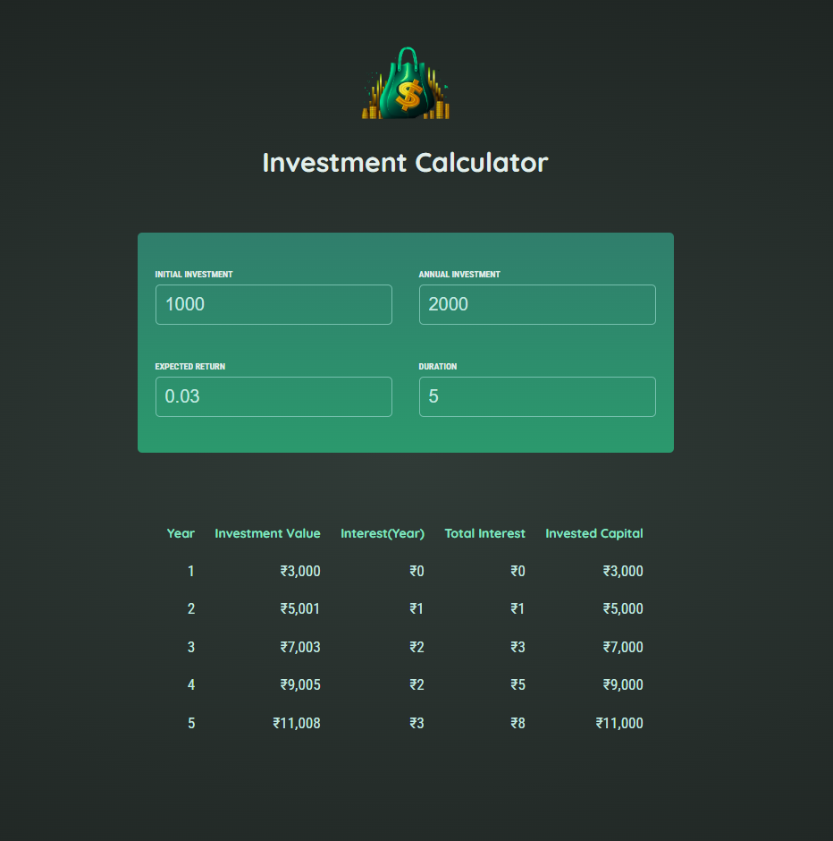

###   Level Up Your Finances: Investment Calculator! 


## Installing Guide for React Project

### Step 1: Install Node.js and npm

Make sure you have Node.js and npm installed on your system. You can download and install Node.js from the official website [Node.js Downloads](https://nodejs.org/en/download/). npm comes bundled with Node.js.

### Step 2: Create a React App

You can create a new React app using Create React App, a popular tool for generating React projects with a pre-configured setup.

```bash
npx create-react-app my-react-app
```

Replace `my-react-app` with your preferred project name.

### Step 3: Navigate to Your Project Directory

```bash
cd my-react-app
```

Replace `my-react-app` with your project directory name.

### Step 4: Run the Development Server

Start the development server to preview your React application locally.

```install required node modules and other packages
npm i
```


### Step 6: Run  (Optional)


```bash
npm run dev
```


